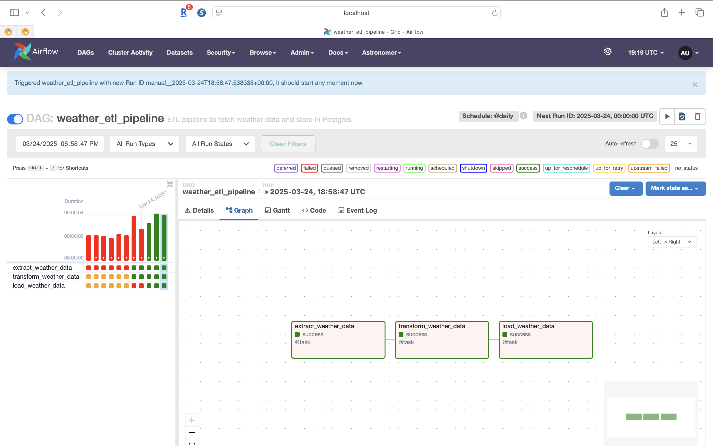

# 🌦️ ETL Pipeline using Apache Airflow

This project demonstrates a complete end-to-end ETL (Extract, Transform, Load) pipeline using **Apache Airflow**, **PostgreSQL**, and **Open-Meteo API**, all containerized with **Docker**.

---

## 🚀 What This Project Does

- 🔄 **Extract**: Weather data from the Open-Meteo API
- 🔧 **Transform**: Formats the JSON response into clean tabular data
- 🗄️ **Load**: Inserts transformed data into a PostgreSQL database
- 📅 **Schedules**: Runs daily using Airflow's scheduler

---

## 🛠️ Tech Stack

- 🧬 Apache Airflow
- 🐘 PostgreSQL (Dockerized)
- 🐳 Docker + Docker Compose
- ☁️ Open-Meteo API
- 🧑‍💻 Python

---

## 📂 Project Structure

```bash
├── dags/
│   └── etlweather.py          # The main DAG file
├── docker-compose.yml         # Local container orchestration
├── requirements.txt           # Python dependencies (if needed)
├── README.md                  # You’re looking at it 

⚙️ How to Run Locally
	1.	Start Docker
	2.	Run Airflow with Astro CLI 
    ```bash
    astro dev start
    ```
    3.	Open Airflow UI: http://localhost:8080
	•	Username: admin
	•	Password: admin
	4.	Trigger the DAG: weather_etl_pipeline 

🔍 Verify in Postgres

Connect via any client like DBeaver: 
``` bash
Host: localhost
Port: 5432
User: postgres
Password: postgres
Database: postgres
```

Check data:
```bash
SELECT * FROM weather;
```
🧠 What You’ll Learn
	•	How to structure a real-world ETL pipeline
	•	Using Airflow’s task decorators and hooks
	•	Managing containers and services via Docker
	•	Debugging and developing in an MLOps-style workflow 

    
## 🖼️ DAG Screenshot

Here’s what the pipeline looks like in the Airflow UI:

 
